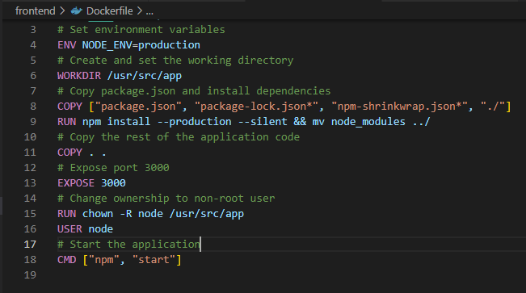
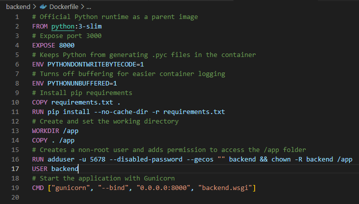
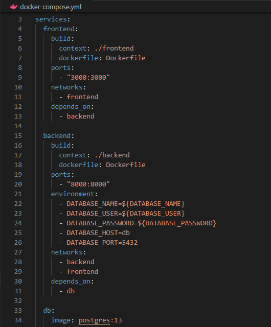
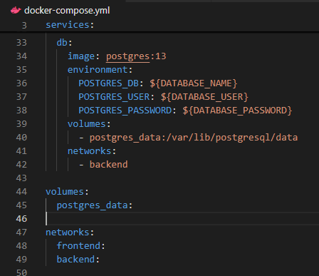

# Lets Dockerize it just for fun as we learn
## Django-React-Full-Stack-App Dockerization

This repository contains the Dockerized version of the [Django-React-Full-Stack-App](https://github.com/techwithtim/Django-React-Full-Stack-App), a full-stack application built using Django and React. This project was originally coded in a video tutorial by Tech With Tim, which you can find [here on YouTube](https://www.youtube.com/watch?v=c-QsfbznSXI&t=9s).


## Dockerizing the Application

### Added Dockerfiles

We have added Dockerfiles for both the backend (Django) and frontend (React) components of the application.

#### Frontend Dockerfile


#### Backend Dockerfile


#### Compose file



### Environment Variables
To securely manage environment variables, create a .env file in the project root:

```.env
DATABASE_NAME=your_db_name
DATABASE_USER=your_db_user
DATABASE_PASSWORD=your_db_password
```
### Building and Running the Docker Images
#### Build the DATABASE
Navigate to the directory containing your docker-compose.yml file and run the following command to build the Docker images:

    docker network create database
    docker run --name my-postgres -e POSTGRES_USER=backend -e POSTGRES_PASSWORD=backend -d --network=database postgres

#### Build the BACKEND
Navigate to the directory containing your docker-compose.yml file and run the following command to build the Docker images:

    docker build -t todo_backend:v1 .
    docker run --name todo_backend -p 8000:8000 --network=database -d todo_backend:v1
    docker exec -it todo_backend python3 manage.py migrate

#### Build the FRONTEND
Navigate to the directory containing your docker-compose.yml file and run the following command to build the Docker images:

    docker build -t todo_frontend:v1 .
    docker run --name todo_frontend -d -p 3000:3000 todo_frontend:v1

### Access the Application
The frontend will be accessible at:

    http://127.0.0.1:3000
The backend will be accessible at:
    
    http://127.0.0.1:8000

### Pushing Images to Docker Hub
#### Tag Docker Images
After building the images, tag them with your Docker Hub repository name. Replace <username> with your Docker Hub username and <repository> with your repository name:

    docker tag todo_frontend:latest <username>/shop:v1

    docker tag project-root_backend:latest <username>/shop:v1

#### Push Docker Images to Docker Hub
Push the tagged images to Docker Hub:

    docker push <username>/shop:v1

### Build the Images with DOCKER COMPOSE
Navigate to the directory containing your docker-compose.yml file and run the following command to build the Docker images:

    docker-compose -p fullstack up -d

## Cleanup

    docker-compose -p fullstack down
    docker-compose ls

## Acknowledgments
We would like to acknowledge Tech With Tim for the original tutorial and codebase. This Dockerization project builds upon the fantastic work done in the tutorial to create a containerized version of the application.
## Resources
- **VS code docker extension**: https://aka.ms/vscode-docker-python
- **Article**: https://betterstack.com/community/guides/scaling-python/dockerize-django/
## Conclusion
In this repository, we've Dockerized the Django-React-Full-Stack-App following the tutorial by Tech With Tim. We added Dockerfiles for both the backend and frontend, created a Docker Compose setup for multi-container orchestration, and provided instructions for building and pushing the Docker images to Docker Hub.

Feel free to clone the repository and follow the steps to get the application up and running in a Dockerized environment. Happy coding!
